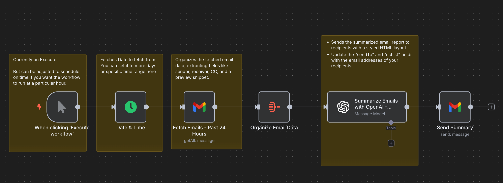
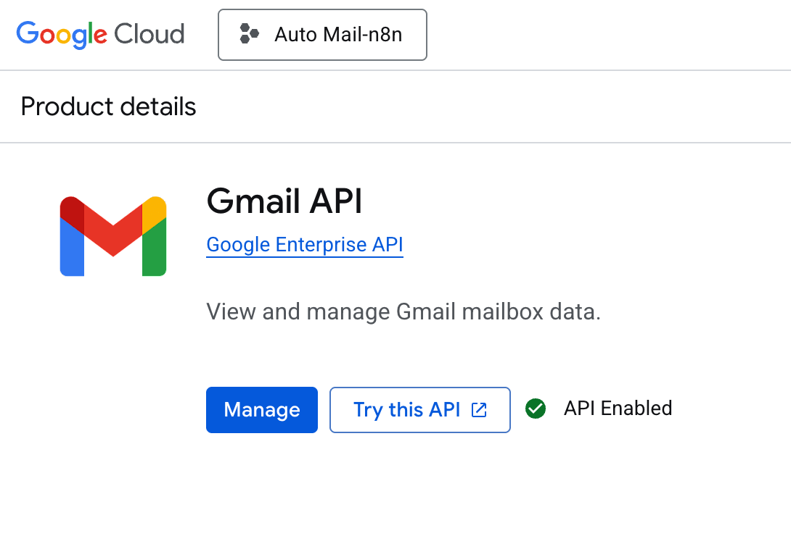
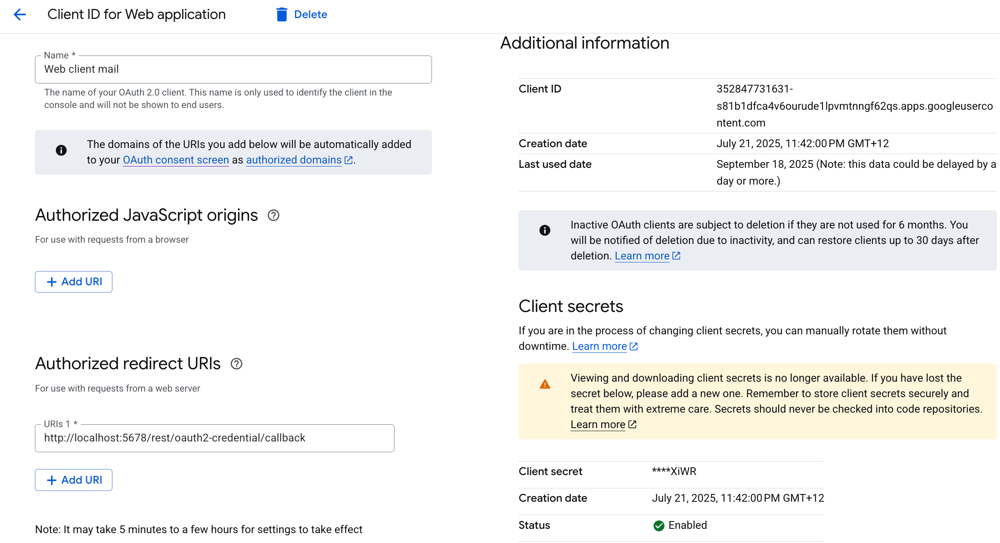

# 📧 Automated Email Summary Workflow

An **n8n automation** that connects your Gmail and OpenAI accounts to automatically fetch, summarise, and email a daily digest of your inbox — all in one workflow.

---

##  Overview

This workflow:
1. Fetches your Gmail emails from the last 24 hours (or any chosen range).
2. Extracts key details — sender, recipients, CC, and message snippet.
3. Summarizes your inbox using **OpenAI**.
4. Sends the summary back to your email in a clean, styled HTML layout.

---

##  Workflow Preview

> 💡 You can manually run this workflow or schedule it to execute automatically (e.g., every morning at 9 AM).

---

## ⚙️ Setup Guide

### 1. Enable Gmail API (Google Cloud Platform)

To let n8n fetch and send emails securely:

1. Go to [Google Cloud Console](https://console.cloud.google.com/).  
2. Create a **new project** or select an existing one.  
3. Enable the **Gmail API** under “APIs & Services → + ENABLE APIS AND SERVICES.”  
   
4. Go to **Credentials → Create Credentials → OAuth client ID**.
5. Choose **Web application**, and set your redirect URI to:  
6. Download the **credentials.json** file.
7. In **n8n**, create a new **Google OAuth2 credential** and upload your client ID and secret.  

✅ Your Gmail account is now connected securely to n8n.

---

### 2. Connect OpenAI API

1. Get your API key from [OpenAI](https://platform.openai.com/account/api-keys).  
2. In **n8n**, add a new **OpenAI credential** and paste your key.  
3. The workflow will use this to summarise your emails automatically.

---

### 3. Import and Configure the Workflow

1. In **n8n**, click **Import → Paste JSON or Upload File**.  
2. Attach:
- **Google Credential** → Gmail nodes  
- **OpenAI Credential** → Summarise node  
3. Adjust:
- **Date & Time node** → set the range (default: 24h)  
- **Send Summary node** → set your `sendTo` and `ccList` addresses  

---

### 4. Automate the Summary

To receive your summary automatically:
1. Replace the manual trigger with a **Cron** node.  
2. Set it to run daily (e.g., 9:00 AM).  
3. You’ll get your daily inbox summary each morning. ☀️

---

## 💡 Customisation Ideas

- Fetch only emails from specific **labels** or **senders**
- Include **attachments** or direct Gmail links  
- Add **sentiment analysis**  
- Send summaries to **Slack**, **Teams**, or **Notion**  
- Export reports as **CSV** or **PDF**

---

## 🧠 Tech Stack

- **n8n** – Workflow automation  
- **Gmail API (GCP)** – Email fetch & send  
- **OpenAI API** – Summarization  
- **JavaScript / JSON** – Data formatting  
- **HTML Templates** – Styled report emails  

---

## 🔒 Security Notes

- Don’t share your `credentials.json`.  
- Use n8n’s **Credential Manager** to store secrets securely.  
- Rotate your OpenAI key regularly.  
- Limit Gmail API scopes to “read/send” only.

---

